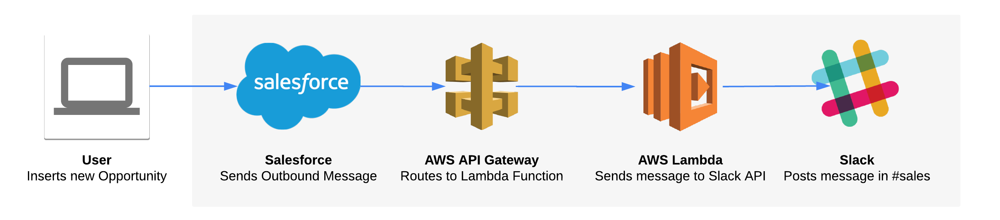

# Serverless Slack Bot

> Learn how to build your own serverless Slack bot using AWS Lambda and API Gateway, integrated with Salesforce
>
> _Read the [blog article here](http://mavens.github.io/2018/03/06/build-a-serverless-slack-bot-using-aws-lambda-and-salesforce)._

## Installation

```bash
$ git clone git@github.com:jpmonette/serverless-slack-bot.git
$ cd serverless-slack-bot
$ yarn
$ sed -i -e 's/\[my-api-token\]/insert-your-slack-token-here/g' up.json
$ up
```

> **NOTE**: Make sure you replace `insert-your-slack-token-here` with your own Slack token

## Features

* Easily deployed to the AWS cloud
* Cost-effective: Lambda function only running on request

## Requirements

* NodeJS
* TypeScript
* yarn
* up
* An AWS Account
* A Slack workspace

## More Information

* [Build a serverless Slack bot using AWS Lambda and Salesforce](http://mavens.github.io/2018/03/06/build-a-serverless-slack-bot-using-aws-lambda-and-salesforce) on Mavens Developer Blog
* [Getting Started with the Slack API](https://api.slack.com/getting-started)
* [Mavens Developer Blog](http://mavens.github.io/)
* Follow [@jpmonette](https://twitter.com/jpmonette) on Twitter for updates
* Read my personal blog [Blogue de Jean-Philippe Monette](http://blogue.jpmonette.net/) to learn more about what I do!

## License

Permission is hereby granted, free of charge, to any person obtaining a copy of this software and associated documentation files (the "Software"), to deal in the Software without restriction, including without limitation the rights to use, copy, modify, merge, publish, distribute, sublicense, and/or sell copies of the Software, and to permit persons to whom the Software is furnished to do so, subject to the following conditions:

The above copyright notice and this permission notice shall be included in all copies or substantial portions of the Software.

THE SOFTWARE IS PROVIDED "AS IS", WITHOUT WARRANTY OF ANY KIND, EXPRESS OR IMPLIED, INCLUDING BUT NOT LIMITED TO THE WARRANTIES OF MERCHANTABILITY, FITNESS FOR A PARTICULAR PURPOSE AND NONINFRINGEMENT. IN NO EVENT SHALL THE AUTHORS OR COPYRIGHT HOLDERS BE LIABLE FOR ANY CLAIM, DAMAGES OR OTHER LIABILITY, WHETHER IN AN ACTION OF CONTRACT, TORT OR OTHERWISE, ARISING FROM, OUT OF OR IN CONNECTION WITH THE SOFTWARE OR THE USE OR OTHER DEALINGS IN THE SOFTWARE.